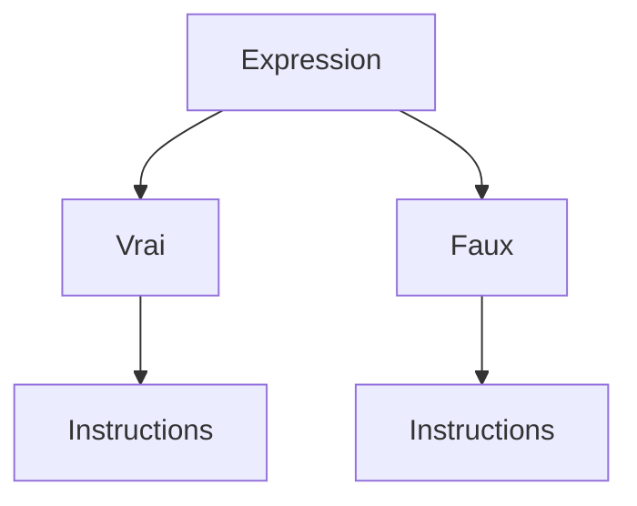

> ⚠️

> ℹ️
# Cours Python


## 1.1 Les variables

### Définition d'une variable
Python utilise des variables pour stocker des données. Une variable représente un espace mémoire nommé dans lequel une valeur est stockée, facilitant ainsi l'accès à cette information en mémoire.##

### Les types de variables en Python

Les variables peuvent contenir différents types de données. Voici les principaux types en Python :

- Entier (int) : Un nombre entier, comme 4.
- Flottant (float) : Un nombre décimal, comme 2.5 (note : en Python, on utilise un point pour les décimaux).
- Chaîne de caractères (str) : Un texte, comme 'hello' ou "a".
- Booléen (bool) : Une valeur logique, soit True (vrai) ou False (faux).

### Déclaration et nommage d'une variable
Pour déclarer une variable, on utilise le symbole "=" pour affecter une valeur à un nom de variable, qui est une étiquette pointant vers une zone mémoire.

> ⚠️ *A noter que les noms de variables doivent toujours commencer par une lettre ou un underscore "_" et ne pas être un mot réservé.*

Dans python, les mots réservés servent à définir la structure et la syntax du language Python (boucle, définition de fonction, etc.), ces mots clés ne peuvent être repris comme nom de variable.

La convention de nommage "snake_case" est utilisée en Python :

- sans majuscules,
- avec des underscores "_" entre les mots.

En revanche, dans certains langages, on utilise "CamelCase" avec des majuscules pour chaque mot, sans underscores.

Exemple de création et manipulation de variables en Python :
```
# Calcul du salaire mensuel à partir du salaire annuel

salaire_annuel = 36000    # Création d'une variable qui contient la valeur du salaire annuel
nb_mois = 12              # Création d'une variable qui contient le nombre de mois

# Pour calculer le salaire mensuel, je fais alors appel aux 2 variables précédemment créées
salaire_mensuel = salaire_annuel / nb_mois        
```

### Vérifier le type d'une variable existante
La fonction type() permet de vérifier le type d’une variable. Elle s’utilise ainsi :
```
# Déclaration de deux variables
salaire_annuel = 40000
prenom = 'Lionel'

# Affichage du type de chaque variable à l’aide de print() et type()
print(type(salaire_annuel))   # Affiche <class 'int'>
print(type(prenom))           # Affiche <class 'str'>
```

### Changer le type d'une variable en Python (cast)
En Python, il est parfois nécessaire de convertir une variable d'un type à un autre, par exemple pour faire des calculs entre différents types de données ou pour manipuler les données saisies par l'utilisateur. Cette opération s'appelle le casting.
Les fonctions de casting couramment utilisées en Python sont :

- int() pour convertir en entier,
- float() pour convertir en nombre décimal,
- str() pour convertir en chaîne de caractères.
Exemple de cast entre différents types :
```
# Conversion d'une chaîne en entier
age_str = "25"                     # Chaîne de caractères
age_int = int(age_str)             # Conversion de la chaîne en entier

# Conversion d'un entier en chaîne
salaire_annuel = 36000             # Entier
salaire_str = str(salaire_annuel)  # Conversion en chaîne de caractères

# Conversion d'un entier en flottant
age_flottant = float(age_int)      # Conversion d'un entier en flottant      
```

> ⚠️ *Si une conversion est impossible (par exemple, convertir une chaîne qui contient des lettres en entier), Python retournera une erreur.*


## Gérer les entrées/sorties
En Python, les fonctions print() et input() sont utilisées pour interagir avec l'utilisateur.

print() affiche un texte ou une valeur à l'écran.
input() permet de demander une saisie utilisateur. La valeur saisie est retournée sous forme de chaîne de caractères.
```
# Demander à l'utilisateur son nom.
nom = input("Quel est ton nom ? ")

# Afficher le nom de l'utilisateur.
print("Bonjour, " + nom + " !")
```
1. Chaîne de caractères (string) 📝  
C'est le cas le plus simple. La fonction `input()` renvoie directement une chaîne de caractères.

```
# Demander une chaîne de caractères
nom_utilisateur = input("Entrez votre nom : ")
print(f"Bonjour, {nom_utilisateur} !")
```

2. Entier (integer) 🔢  
Pour obtenir un nombre entier, il faut convertir la sortie de `input()` en utilisant la fonction `int()`.
```
# Demander un entier
try:
    age = int(input("Quel est votre âge ? "))
    print(f"Vous aurez {age + 1} ans l'année prochaine.")
except ValueError:
    print("Erreur : Veuillez entrer un nombre entier valide.")
```

3. Flottant (float) 💧  
Pour un nombre à virgule, le principe est le même, mais on utilise la fonction `float()`.
```
# Demander un flottant
try:
    prix = float(input("Entrez le prix de l'article (ex: 9.99) : "))
    prix_ttc = prix * 1.20
    print(f"Le prix toutes taxes comprises est de {prix_ttc:.2f} €.")
except ValueError:
    print("Erreur : Veuillez entrer un nombre valide.")
```

4. Booléen (boolean) ✅/❌  
Obtenir un booléen (`True` ou `False`) demande une petite logique supplémentaire, car l'utilisateur ne va pas taper "True" ou "False". L'idée est de vérifier si sa réponse correspond à une valeur affirmative.
```
# Demander une réponse et la convertir en booléen
reponse = input("Aimez-vous Python ? (oui/non) ")

# On convertit la réponse en minuscule pour être flexible
aime_python = reponse.lower() == "oui"

if aime_python:
    print("Super ! C'est un excellent langage.")
else:
    print("Dommage, peut-être une autre fois !")

# La variable aime_python contient maintenant True ou False
print(f"Valeur booléenne : {aime_python}")
```


## 1.2 Les opérateurs

### Qu'est ce qu'un opérateur en python ?

Un opérateur est un symbole (`+`, `>`, `=`,`<=`...) ou un mot réservé (`and`, `or`, `is`...) permettant de réaliser une opération.

Les opérateurs sont essentiels en programmation : ils permettent de réaliser des opérations mathématiques entre des variables (opérateurs arithmétiques), de comparer des valeurs (opérateurs de comparaison) ou de combiner des expressions vraies ou fausses (opérateurs logiques).

### Les opérateurs arithmétiques
Ces opérateurs permettent d'effectuer des opérations mathématiques comme par exemple l'addition ou encore la soustraction. Voici une liste des opérateurs arithmétiques que tu utiliseras fréquemment :

|Opérateur|Opération|Exemples|Résultat|
|:-:|:-:|:-:|:-:|
|+|Addition|5 + 2|7|
|+|Soustraction|5 - 2|3|
|*|Multiplication|5 * 2|10|
|/|Division|5 / 2|2.5|
|//|Division entière|5 // 2|2|
|%|Modulo (reste de la division)|5 % 2|1|
|**|Exponentiation|5 ** 2|25|

### Les opérateurs de comparaison

Ces opérateurs permettent de comparer deux valeurs, et le résultat est un booléen (`True` ou `False`). Voici une liste des opérateurs de comparaison avec des exemples :

|Opérateur|Opération|Exemples|Résultat|
|:-:|:-:|:-:|:-:|
|<|Inférieur|9 < 4.5|False|
|<=|Inférieur ou égal|9 <= 4.5|False|
|>|Supérieur|9 > 4.5|True|
|>=|Supérieur ou égal|9 >= 4.5|True|
|==|Egal|9 == 4.5|False|
|!=|Différent|9 != 4.5|True|
|is|Identique|9 is 4.5|False|
|is not|Non identique|9 is not 4.5|True|

### Les opérateurs logiques

Comme pour les opérateurs de comparaison, les opérateurs logiques renvoient un booléen. Tu rencontreras les opérateurs `and`, `or`, et `not`. Le tableau ci-dessous montre quelques exemples :

| Opérateur | Opération | Exemple | Résultat |
|---|---|---|---|
| **and** | Vérifie si deux expressions sont **toutes les deux vraies** | `x = 12`<br>`y = -32`<br>`(x > 0) and (y > 0)` | **False**<br>Une seule des deux expressions est vraie |
| **or** | Vérifie si parmi deux expressions **l'une ou l'autre est vraie** | `x = 12`<br>`y = -32`<br>`(x > 0) or (y > 0)` | **True**<br>Une des deux expressions est vraie |
| **not** | Inverse le résultat d'une expression | `not (9 <= 4.5)` | **True**<br>L'expression initiale renvoie False, le résultat final est donc True. |


## Exercice 


### Les opérateurs

Sources : https://colab.research.google.com/drive/1ASRk2qIvGkZCmf2YMKyuxrhOuSk4cjje#scrollTo=WjJmN0AxZBLw

#### 1. Calcul d'un prix
Ecrivez un programme faisant saisir à l’utilisateur un prix unitaire HT, un taux de TVA et un nombre d’articles, et qui calcule le montant TTC de l’achat.
Affichez le montant TTC.
<details>
<summary>Solution</summary>  
    
prixUnitaireHT = float(input("Prix unitaire HT : "))  
    
TVA = float(input("Taux de la TVA en % : "))  

NbArticle = int(input("Nombre d'article : "))  
   
prixTtc = prixUnitaireHT * (1 + TVA / 100)
  
NbFinal = NbArticle * prixTtc  
  
print("Prix final :", NbFinal)  
</details>

#### 2. Conversion de durées (1)
Ecrivez un programme demandant une durée en secondes à l’utilisateur, et qui la convertit en heures, minutes, secondes.
Affichez le résultat.
Par exemple 12334 deviendra 3 heures, 25 minutes et 34 secondes.

<details>
<summary>Solution</summary>  
    
dureeSecondeTotal = int(input("Entrez la durée en secondes : "))

dureeHeure = dureeSecondeTotal // 3600

dureeMinute = (dureeSecondeTotal % 3600) // 60

dureeSeconde = (dureeSecondeTotal % 3600) % 60

print(f"{dureeSecondeTotal} secondes fait {dureeHeure} Heures, {dureeMinute} Minutes et {dureeSeconde} Secondes" )
</details>


#### 3. Conversion de durées (2)
Ecrivez un programme demandant une durée en heures, minutes, secondes à l’utilisateur et qui la convertit en secondes.
Affichez le résultat.
Par exemple 3 heures, 25 minutes et 34 secondes deviendra 12334 secondes.
<details>
<summary>Solution</summary>  
    
Heure = int(input("Nombre d'heures : "))

Minute = int(input("Nombre de minutes : "))

Seconde = int(input("Nombre de secondes : "))

heureEnSeconde = Heure * 3600

minuteEnSeconde = Minute * 60

dureeTotale = heureEnSeconde + minuteEnSeconde + Seconde

print(f"{Heure} heures, {Minute} minutes et {Seconde} secondes font {dureeTotale} secondes")
</details>


## 1.3 Les structures conditionnelles

### L'indentation

En Python, l'indentation consiste à ajouter des espaces ou des tabulations en début de ligne pour structurer le code. Contrairement à de nombreux autres langages, où des symboles comme {} sont utilisés pour délimiter des blocs de code, Python utilise uniquement l'indentation pour indiquer quelles instructions appartiennent à un même bloc.

> ℹ️ La notion de bloc sera expliqué dans la suite de cette quête.

> ⚠️Règles d’indentation en Python
> - Espace ou tabulation : Il est recommandé d'utiliser 4 espaces pour chaque niveau d'indentation.
> - Cohérence : Mélanger espaces et tabulations dans le même fichier est déconseillé et peut entraîner des erreurs.

### Les structures conditionnelles
Dans la vie quotidienne, tu prends souvent des décisions en fonction de certaines informations.

Exemple :  
```
Demain s'il fait beau, j'irai à la plage.  
Sinon je resterai au chaud et je lirai un livre.
```  
En programmation, il est possible de représenter ce type de décision avec des structures conditionnelles qui permettent d’appliquer des instructions différentes selon les situations.



Dans le code, pour définir une structure conditionnelle, on utilise des opérateurs qui évaluent une expression. En fonction du résultat, Python exécute un bloc d’instructions associé à cette condition.

Exemple : si tu souhaites retirer 100 € de ton compte et que tu as déjà atteint ton découvert autorisé, le distributeur affichera "Solde insuffisant" et ne délivrera pas d’argent. Sinon, il délivrera la somme demandée. Voici ce cas représenté en pseudo-code :
```
si solde_suffisant:
    Retirer(somme_demandée)
    Afficher("Transaction réussie")
sinon:
    Afficher("Solde insuffisant")
```
> ℹ️ Le pseudo-code permet de formuler un algorithme ou un problème en un langage proche du français, avant de l’écrire en code Python.

Dans cet exemple, les mots-clés "si" et "sinon" permettent de définir deux scénarios distincts. En Python, tu trouveras trois types de structures conditionnelles :

- if ("si”)
- if … else (“si … sinon”)
- if … elif … else (“si … sinon si … sinon”)

#### La structure conditionnelle `if`

Le `if` s’utilise pour exécuter un bloc de code uniquement si une condition est vraie. Si la condition est fausse, le bloc est ignoré.
```
x = 10

if x > 12:                                # condition (retourne un booléen, True ou False)
  print("La condition est remplie")
else:                                     # ici j'indique quoi faire si la condition n'est pas remplie
  print("La condition n'est pas remplie")

# la condition n'est pas remplie (False), c'est la seconde instruction print() qui est exécutée
```
> ℹ️ N'oublie pas le `:` après la condition du `if` et après le `else`.

#### La structure conditionnelle `if` ... `elif` ... `else`

Si plus de deux cas doivent être gérés, imbriquer `if` et `else` peut rendre le code difficile à lire. Utilise plutôt `if` … `elif` … `else`.

> ℹ️ Il est possible d'ajouter plusieurs `elif` entre le `if` et le `else` pour prendre en compte beaucoup de cas possibles.

```
x = 12

if x > 12:                                # 1er condition
  print("La condition 1 est remplie")
elif x == 12:                             # 2e condition
  print("La condition 2 est remplie")     
else:                                     # Si aucune des 2 conditions n'est remplie on indique quoi faire
  print("Aucune des 2 conditions n'est remplie")

# la condition 2 est remplie, c'est la 2e instruction print() qui est exécutée
```

#### Quiz 

1. Quel est le résultat affiché par le code ci-dessous ?
```
if (5 > 10):
print("Tomato")
elif (8 != 9):
print("Banana")
else:
print("Apple")
```
- Banana
- Tomato
- Apple

<details>
<summary>Solution</summary> 
Banana
</details>


2. Quel est le résultat affiché par le code ci-dessous ?
```
name = "marie"
if name == "mary":
    print("Ireland")
elif name == "maria":
    print("Colombia")
else:
    print("France")
```
- Colombia
- Ireland
- France

<details>
<summary>Solution</summary> 
France
</details>

3. Quel est le résultat affiché par le code ci-dessous ?
```
Age = 21
if (Age < 12):
    print("Kid")
elif (Age >= 12) and (Age < 21):
    print("Teenager")
else:
    print("Adult")
```

- Kid
- Adult
- Teenager

<details>
<summary>Solution</summary> 
Adult
</details>

4. Quel est le résultat affiché par le code ci-dessous ?

```
Age = 12
if not (Age != 12):
    print("Kid")
else:
    print("Other")
```
- Kid
- Other

<details>
<summary>Solution</summary> 
Kid
</details>

## Exercice 


### Les structures conditionnelle

Source : https://colab.research.google.com/drive/1gKL8b7j8-vyWbFwmwCEHyltlhTep486j

1. Calcul du montant d'une remise

Un commerçant accorde une remise de 5 % pour tout achat d’un montant compris entre 100 et 500 € et 8 % au-delà.
Ecrivez un programme de calcul du montant de la remise sur un achat donné.
Affichez le montant de la remise.

<details>
<summary>Solution</summary> 
prix = float(input("Quel est le prix en € : "))

if ((prix >= 100) and (prix < 500)):
    remise = prix/100 * 5

elif (prix >=500):
    remise = prix/100 * 8 

elif (prix < 100):
    remise = "Achat inférieur a 100 €, aucune remise possible"
    
print(f"La remise est de : {remise}")
</details>

2. Savoir si trois entiers sont triés
Ecrivez un programme faisant saisir trois entiers x, y, z à l’utilisateur, et lui indiquer si ces nombres sont dans l’ordre croissant (x <= y <= z).

<details>
<summary>Solution</summary> 
x = int(input("Entrer le premier nombre entier x = ? :"))  
y = int(input("Entrer le second nombre entier y = ? :"))  
z = int(input("Entrer le troisième nombre entier z = ? :"))  

if (x < y) and (y < z):
    print(f"{x}, {y}, {z} sont dans l'ordre croissant")

else:
    print(f"{x}, {y}, {z} ne sont pas dans l'ordre croissant")
</details>

3. Tri de trois réels
Ecrivez un programme faisant saisir trois nombres réels x, y, z à l’utilisateur et qui les trie par ordre croissant (à la fin du déroulement du programme x ≤ y ≤ z).
Affichez x, y et z.

<details>
<summary>Solution</summary> 
toto
</details>

4. Signe d'un produit
Ecrivez un programme qui affiche le signe du produit de deux nombres réels sans calculer la valeur de ce produit. Par signe, on entend positif, négatif ou nul.

<details>
<summary>Solution</summary> 
toto
</details>
