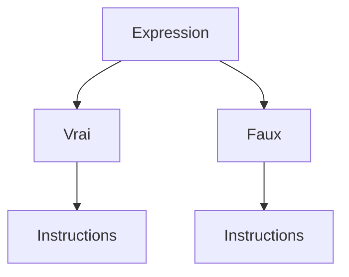

> ⚠️

> ℹ️
# Cours Python


## 1.1 Les variables

### Définition d'une variable
Python utilise des variables pour stocker des données. Une variable représente un espace mémoire nommé dans lequel une valeur est stockée, facilitant ainsi l'accès à cette information en mémoire.##

### Les types de variables en Python

Les variables peuvent contenir différents types de données. Voici les principaux types en Python :

- Entier (int) : Un nombre entier, comme 4.
- Flottant (float) : Un nombre décimal, comme 2.5 (note : en Python, on utilise un point pour les décimaux).
- Chaîne de caractères (str) : Un texte, comme 'hello' ou "a".
- Booléen (bool) : Une valeur logique, soit True (vrai) ou False (faux).

### Déclaration et nommage d'une variable
Pour déclarer une variable, on utilise le symbole "=" pour affecter une valeur à un nom de variable, qui est une étiquette pointant vers une zone mémoire.

> ⚠️ *A noter que les noms de variables doivent toujours commencer par une lettre ou un underscore "_" et ne pas être un mot réservé.*

Dans python, les mots réservés servent à définir la structure et la syntax du language Python (boucle, définition de fonction, etc.), ces mots clés ne peuvent être repris comme nom de variable.

La convention de nommage "snake_case" est utilisée en Python :

- sans majuscules,
- avec des underscores "_" entre les mots.

En revanche, dans certains langages, on utilise "CamelCase" avec des majuscules pour chaque mot, sans underscores.

Exemple de création et manipulation de variables en Python :
```
# Calcul du salaire mensuel à partir du salaire annuel

salaire_annuel = 36000    # Création d'une variable qui contient la valeur du salaire annuel
nb_mois = 12              # Création d'une variable qui contient le nombre de mois

# Pour calculer le salaire mensuel, je fais alors appel aux 2 variables précédemment créées
salaire_mensuel = salaire_annuel / nb_mois        
```

### Vérifier le type d'une variable existante
La fonction type() permet de vérifier le type d’une variable. Elle s’utilise ainsi :
```
# Déclaration de deux variables
salaire_annuel = 40000
prenom = 'Lionel'

# Affichage du type de chaque variable à l’aide de print() et type()
print(type(salaire_annuel))   # Affiche <class 'int'>
print(type(prenom))           # Affiche <class 'str'>
```

### Changer le type d'une variable en Python (cast)
En Python, il est parfois nécessaire de convertir une variable d'un type à un autre, par exemple pour faire des calculs entre différents types de données ou pour manipuler les données saisies par l'utilisateur. Cette opération s'appelle le casting.
Les fonctions de casting couramment utilisées en Python sont :

- int() pour convertir en entier,
- float() pour convertir en nombre décimal,
- str() pour convertir en chaîne de caractères.
Exemple de cast entre différents types :
```
# Conversion d'une chaîne en entier
age_str = "25"                     # Chaîne de caractères
age_int = int(age_str)             # Conversion de la chaîne en entier

# Conversion d'un entier en chaîne
salaire_annuel = 36000             # Entier
salaire_str = str(salaire_annuel)  # Conversion en chaîne de caractères

# Conversion d'un entier en flottant
age_flottant = float(age_int)      # Conversion d'un entier en flottant      
```

> ⚠️ *Si une conversion est impossible (par exemple, convertir une chaîne qui contient des lettres en entier), Python retournera une erreur.*


## Gérer les entrées/sorties
En Python, les fonctions print() et input() sont utilisées pour interagir avec l'utilisateur.

print() affiche un texte ou une valeur à l'écran.
input() permet de demander une saisie utilisateur. La valeur saisie est retournée sous forme de chaîne de caractères.
```
# Demander à l'utilisateur son nom.
nom = input("Quel est ton nom ? ")

# Afficher le nom de l'utilisateur.
print("Bonjour, " + nom + " !")
```
1. Chaîne de caractères (string) 📝  
C'est le cas le plus simple. La fonction `input()` renvoie directement une chaîne de caractères.

```
# Demander une chaîne de caractères
nom_utilisateur = input("Entrez votre nom : ")
print(f"Bonjour, {nom_utilisateur} !")
```

2. Entier (integer) 🔢  
Pour obtenir un nombre entier, il faut convertir la sortie de `input()` en utilisant la fonction `int()`.
```
# Demander un entier
try:
    age = int(input("Quel est votre âge ? "))
    print(f"Vous aurez {age + 1} ans l'année prochaine.")
except ValueError:
    print("Erreur : Veuillez entrer un nombre entier valide.")
```

3. Flottant (float) 💧  
Pour un nombre à virgule, le principe est le même, mais on utilise la fonction `float()`.
```
# Demander un flottant
try:
    prix = float(input("Entrez le prix de l'article (ex: 9.99) : "))
    prix_ttc = prix * 1.20
    print(f"Le prix toutes taxes comprises est de {prix_ttc:.2f} €.")
except ValueError:
    print("Erreur : Veuillez entrer un nombre valide.")
```

4. Booléen (boolean) ✅/❌  
Obtenir un booléen (`True` ou `False`) demande une petite logique supplémentaire, car l'utilisateur ne va pas taper "True" ou "False". L'idée est de vérifier si sa réponse correspond à une valeur affirmative.
```
# Demander une réponse et la convertir en booléen
reponse = input("Aimez-vous Python ? (oui/non) ")

# On convertit la réponse en minuscule pour être flexible
aime_python = reponse.lower() == "oui"

if aime_python:
    print("Super ! C'est un excellent langage.")
else:
    print("Dommage, peut-être une autre fois !")

# La variable aime_python contient maintenant True ou False
print(f"Valeur booléenne : {aime_python}")
```


## 1.2 Les opérateurs

### Qu'est ce qu'un opérateur en python ?

Un opérateur est un symbole (`+`, `>`, `=`,`<=`...) ou un mot réservé (`and`, `or`, `is`...) permettant de réaliser une opération.

Les opérateurs sont essentiels en programmation : ils permettent de réaliser des opérations mathématiques entre des variables (opérateurs arithmétiques), de comparer des valeurs (opérateurs de comparaison) ou de combiner des expressions vraies ou fausses (opérateurs logiques).

### Les opérateurs arithmétiques
Ces opérateurs permettent d'effectuer des opérations mathématiques comme par exemple l'addition ou encore la soustraction. Voici une liste des opérateurs arithmétiques que tu utiliseras fréquemment :

|Opérateur|Opération|Exemples|Résultat|
|:-:|:-:|:-:|:-:|
|+|Addition|5 + 2|7|
|+|Soustraction|5 - 2|3|
|*|Multiplication|5 * 2|10|
|/|Division|5 / 2|2.5|
|//|Division entière|5 // 2|2|
|%|Modulo (reste de la division)|5 % 2|1|
|**|Exponentiation|5 ** 2|25|

### Les opérateurs de comparaison

Ces opérateurs permettent de comparer deux valeurs, et le résultat est un booléen (`True` ou `False`). Voici une liste des opérateurs de comparaison avec des exemples :

|Opérateur|Opération|Exemples|Résultat|
|:-:|:-:|:-:|:-:|
|<|Inférieur|9 < 4.5|False|
|<=|Inférieur ou égal|9 <= 4.5|False|
|>|Supérieur|9 > 4.5|True|
|>=|Supérieur ou égal|9 >= 4.5|True|
|==|Egal|9 == 4.5|False|
|!=|Différent|9 != 4.5|True|
|is|Identique|9 is 4.5|False|
|is not|Non identique|9 is not 4.5|True|

### Les opérateurs logiques

Comme pour les opérateurs de comparaison, les opérateurs logiques renvoient un booléen. Tu rencontreras les opérateurs `and`, `or`, et `not`. Le tableau ci-dessous montre quelques exemples :

| Opérateur | Opération | Exemple | Résultat |
|---|---|---|---|
| **and** | Vérifie si deux expressions sont **toutes les deux vraies** | `x = 12`<br>`y = -32`<br>`(x > 0) and (y > 0)` | **False**<br>Une seule des deux expressions est vraie |
| **or** | Vérifie si parmi deux expressions **l'une ou l'autre est vraie** | `x = 12`<br>`y = -32`<br>`(x > 0) or (y > 0)` | **True**<br>Une des deux expressions est vraie |
| **not** | Inverse le résultat d'une expression | `not (9 <= 4.5)` | **True**<br>L'expression initiale renvoie False, le résultat final est donc True. |


## Exercice 


### Les opérateurs

Sources : https://colab.research.google.com/drive/1ASRk2qIvGkZCmf2YMKyuxrhOuSk4cjje#scrollTo=WjJmN0AxZBLw

#### 1. Calcul d'un prix
Ecrivez un programme faisant saisir à l’utilisateur un prix unitaire HT, un taux de TVA et un nombre d’articles, et qui calcule le montant TTC de l’achat.
Affichez le montant TTC.
<details>
<summary>Solution</summary>  
    
prixUnitaireHT = float(input("Prix unitaire HT : "))  
    
TVA = float(input("Taux de la TVA en % : "))  

NbArticle = int(input("Nombre d'article : "))  
   
prixTtc = prixUnitaireHT * (1 + TVA / 100)
  
NbFinal = NbArticle * prixTtc  
  
print("Prix final :", NbFinal)  
</details>

#### 2. Conversion de durées (1)
Ecrivez un programme demandant une durée en secondes à l’utilisateur, et qui la convertit en heures, minutes, secondes.
Affichez le résultat.
Par exemple 12334 deviendra 3 heures, 25 minutes et 34 secondes.

<details>
<summary>Solution</summary>  
    
dureeSecondeTotal = int(input("Entrez la durée en secondes : "))

dureeHeure = dureeSecondeTotal // 3600

dureeMinute = (dureeSecondeTotal % 3600) // 60

dureeSeconde = (dureeSecondeTotal % 3600) % 60

print(f"{dureeSecondeTotal} secondes fait {dureeHeure} Heures, {dureeMinute} Minutes et {dureeSeconde} Secondes" )
</details>


#### 3. Conversion de durées (2)
Ecrivez un programme demandant une durée en heures, minutes, secondes à l’utilisateur et qui la convertit en secondes.
Affichez le résultat.
Par exemple 3 heures, 25 minutes et 34 secondes deviendra 12334 secondes.
<details>
<summary>Solution</summary>  
    
Heure = int(input("Nombre d'heures : "))

Minute = int(input("Nombre de minutes : "))

Seconde = int(input("Nombre de secondes : "))

heureEnSeconde = Heure * 3600

minuteEnSeconde = Minute * 60

dureeTotale = heureEnSeconde + minuteEnSeconde + Seconde

print(f"{Heure} heures, {Minute} minutes et {Seconde} secondes font {dureeTotale} secondes")
</details>


## 1.3 Les structures conditionnelles

### L'indentation

En Python, l'indentation consiste à ajouter des espaces ou des tabulations en début de ligne pour structurer le code. Contrairement à de nombreux autres langages, où des symboles comme {} sont utilisés pour délimiter des blocs de code, Python utilise uniquement l'indentation pour indiquer quelles instructions appartiennent à un même bloc.

> ℹ️ La notion de bloc sera expliqué dans la suite de cette quête.

> ⚠️Règles d’indentation en Python
> - Espace ou tabulation : Il est recommandé d'utiliser 4 espaces pour chaque niveau d'indentation.
> - Cohérence : Mélanger espaces et tabulations dans le même fichier est déconseillé et peut entraîner des erreurs.

### Les structures conditionnelles
Dans la vie quotidienne, tu prends souvent des décisions en fonction de certaines informations.

Exemple :  
```
Demain s'il fait beau, j'irai à la plage.  
Sinon je resterai au chaud et je lirai un livre.
```  
En programmation, il est possible de représenter ce type de décision avec des structures conditionnelles qui permettent d’appliquer des instructions différentes selon les situations.



Dans le code, pour définir une structure conditionnelle, on utilise des opérateurs qui évaluent une expression. En fonction du résultat, Python exécute un bloc d’instructions associé à cette condition.

Exemple : si tu souhaites retirer 100 € de ton compte et que tu as déjà atteint ton découvert autorisé, le distributeur affichera "Solde insuffisant" et ne délivrera pas d’argent. Sinon, il délivrera la somme demandée. Voici ce cas représenté en pseudo-code :
```
si solde_suffisant:
    Retirer(somme_demandée)
    Afficher("Transaction réussie")
sinon:
    Afficher("Solde insuffisant")
```
> ℹ️ Le pseudo-code permet de formuler un algorithme ou un problème en un langage proche du français, avant de l’écrire en code Python.

Dans cet exemple, les mots-clés "si" et "sinon" permettent de définir deux scénarios distincts. En Python, tu trouveras trois types de structures conditionnelles :

- if ("si”)
- if … else (“si … sinon”)
- if … elif … else (“si … sinon si … sinon”)

#### La structure conditionnelle `if`

Le `if` s’utilise pour exécuter un bloc de code uniquement si une condition est vraie. Si la condition est fausse, le bloc est ignoré.
```
x = 10

if x > 12:                                # condition (retourne un booléen, True ou False)
  print("La condition est remplie")
else:                                     # ici j'indique quoi faire si la condition n'est pas remplie
  print("La condition n'est pas remplie")

# la condition n'est pas remplie (False), c'est la seconde instruction print() qui est exécutée
```
> ℹ️ N'oublie pas le `:` après la condition du `if` et après le `else`.

#### La structure conditionnelle `if` ... `elif` ... `else`

Si plus de deux cas doivent être gérés, imbriquer `if` et `else` peut rendre le code difficile à lire. Utilise plutôt `if` … `elif` … `else`.

> ℹ️ Il est possible d'ajouter plusieurs `elif` entre le `if` et le `else` pour prendre en compte beaucoup de cas possibles.

```
x = 12

if x > 12:                                # 1er condition
  print("La condition 1 est remplie")
elif x == 12:                             # 2e condition
  print("La condition 2 est remplie")     
else:                                     # Si aucune des 2 conditions n'est remplie on indique quoi faire
  print("Aucune des 2 conditions n'est remplie")

# la condition 2 est remplie, c'est la 2e instruction print() qui est exécutée
```

#### Quiz 

1. Quel est le résultat affiché par le code ci-dessous ?
```
if (5 > 10):
print("Tomato")
elif (8 != 9):
print("Banana")
else:
print("Apple")
```
- Banana
- Tomato
- Apple

<details>
<summary>Solution</summary> 
Banana
</details>


2. Quel est le résultat affiché par le code ci-dessous ?
```
name = "marie"
if name == "mary":
    print("Ireland")
elif name == "maria":
    print("Colombia")
else:
    print("France")
```
- Colombia
- Ireland
- France

<details>
<summary>Solution</summary> 
France
</details>

3. Quel est le résultat affiché par le code ci-dessous ?
```
Age = 21
if (Age < 12):
    print("Kid")
elif (Age >= 12) and (Age < 21):
    print("Teenager")
else:
    print("Adult")
```

- Kid
- Adult
- Teenager

<details>
<summary>Solution</summary> 
Adult
</details>

4. Quel est le résultat affiché par le code ci-dessous ?

```
Age = 12
if not (Age != 12):
    print("Kid")
else:
    print("Other")
```
- Kid
- Other

<details>
<summary>Solution</summary> 
Kid
</details>

## Exercice 


### Les structures conditionnelle

Source : https://colab.research.google.com/drive/1gKL8b7j8-vyWbFwmwCEHyltlhTep486j

1. Calcul du montant d'une remise

Un commerçant accorde une remise de 5 % pour tout achat d’un montant compris entre 100 et 500 € et 8 % au-delà.
Ecrivez un programme de calcul du montant de la remise sur un achat donné.
Affichez le montant de la remise.

<details>
<summary>Solution</summary> 
prix = float(input("Quel est le prix en € : "))

if ((prix >= 100) and (prix < 500)):
    remise = prix/100 * 5

elif (prix >=500):
    remise = prix/100 * 8 

elif (prix < 100):
    remise = "Achat inférieur a 100 €, aucune remise possible"
    
print(f"La remise est de : {remise}")
</details>

2. Savoir si trois entiers sont triés
Ecrivez un programme faisant saisir trois entiers x, y, z à l’utilisateur, et lui indiquer si ces nombres sont dans l’ordre croissant (x <= y <= z).

<details>
<summary>Solution</summary> 
x = int(input("Entrer le premier nombre entier x = ? :"))  
y = int(input("Entrer le second nombre entier y = ? :"))  
z = int(input("Entrer le troisième nombre entier z = ? :"))  

if (x < y) and (y < z):
    print(f"{x}, {y}, {z} sont dans l'ordre croissant")

else:
    print(f"{x}, {y}, {z} ne sont pas dans l'ordre croissant")
</details>

3. Tri de trois réels

Ecrivez un programme faisant saisir trois nombres réels x, y, z à l’utilisateur et qui les trie par ordre croissant (à la fin du déroulement du programme x ≤ y ≤ z).
Affichez x, y et z.
```
<details>
<summary>Solution</summary> 

x = int(input("Entrer le premier nombre entier x = ? :"))
y = int(input("Entrer le second nombre entier y = ? :"))
z = int(input("Entrer le troisième nombre entier z = ? :"))

if x <= y <= z:
    print (f"L'ordre croissant est : {x}, {y} et {z}")

elif x <= z <= y:
    print (f"L'ordre croissant est : {x}, {z} et {y}")    
    
elif z <= y <= x:
    print (f"L'ordre croissant est : {z}, {y} et {x}")

elif z <= x <= y:
    print (f"L'ordre croissant est : {z}, {x} et {y}")  
    
elif y <= x <= z:
    print (f"L'ordre croissant est : {y}, {x} et {z}")  

elif y <= z <= x:
    print (f"L'ordre croissant est : {y}, {z} et {x}")
```
</details>

4. Signe d'un produit

Ecrivez un programme qui affiche le signe du produit de deux nombres réels sans calculer la valeur de ce produit. Par signe, on entend positif, négatif ou nul.

<details>
<summary>Solution</summary> 
 premier = int(input("Entrer le premier nombre entier :"))
    
 second = int(input("Entrer le second nombre entier :"))
 
 produit = premier * second

 if produit < 0:
 
    print("Le produit est négatif")

 if produit > 0:

    print("Le produit est positif")

 if produit == 0:

    print("Le produit est nul")
</details>

---

## 1.4 Loops

### Introduction

En programmation, les boucles sont essentielles. Aussi, elles existent pour la plupart des langages de programmation, pas seulement Python.
C'est donc un concept avec lequel vous avez intérêt à vous familiariser.

Tout d'abord, "à quoi peut bien servir une boucle ?"
Honnêtement, à plein de choses bien différentes. Mais ça, tu t'en rendras compte en pratiquant. Petit à petit, tu seras capable d'entremêler plusieurs concepts de base vues pendant la formation, pour les mettre en application face à de vraies problématiques, qu'elles soient professionnelles ou même personnelles !!!

On pourrait par exemple utiliser les boucles pour créer un jeu de quiz, trier des données...

Dans le cas de création de jeu de quiz, on pourrait utiliser les boucles pour que notre programme passe d'une première question à la suivante, une fois que l'utilisateur a répondu à la première question.
Les boucles peuvent être utilisées pour répéter un processus plusieurs fois.
Une fois que l'on maîtrise ce concept, on peut aisément être créatif grâce aux boucles, automatiser des tâches...

Pour le moment, concentrons-nous sur une introduction, dans le but de comprendre une boucle basique.

*"Comment fonctionne une boucle ? Qu'est ce que cela produit comme résultat ?"*

Prenons un exemple:

```
for i in "tutti quanti":
  print(i)
-> t
-> u
-> t
-> t
-> i
-> 
-> q
-> u
-> a
-> n
-> t
-> i
```

Comme on peut le voir ci-dessus, on affiche chaque lettre de "tutti quanti" tour à tour.
Tour à tour, car c'est exactement ce qu'a fait le code : plusieurs tours. D'où le nom "boucle".
À chaque tour, une nouvelle lettre s'affiche. Et ça tombe bien, car c'est exactement ce qu'on a demandé à notre code.

- `"for i in "tutti quanti":"`  --> Pour chaque caractère dans `"tutti quanti"`
- `print(i)` --> Affiche la valeur de ce caractère  
  
Dans le code ci-dessus, i qui fait office de variable temporaire pour notre boucle, fait référence à chaque élément que le code va rencontrer à chaque tour.
Une fois que tous les caractères de "tutti quanti" ont été rencontrés, et bien il n'y a plus aucune raison de faire des tours, donc la boucle s'arrête, et on peut observer le résultat du code.

### Exercice

#### Loop
Source : https://colab.research.google.com/drive/1gGCa-52Qvm-Birl5zqE6ZH6FEQCM8eDW?usp=sharing

1.1 - Fais une boucle qui renvoie les valeurs de 0 à 9.  
`indice`: Utilises la fonction range()
```
for i in range(10):  
  print (i)
```

1.2 - Fais une boucle qui renvoie les valeurs de 1 à 20.
```
for i in range(1, 21):  
  print (i)
```
1.3 - Fais une boucle qui renvoie les nombres pairs entre 2 et 20 inclus.
```
for i in range(2, 21, 2):
    print(i)
```
ou
```
for i in range(1, 21):
    if i % 2 == 0:
        print(i)
```
1.4 - Fais une boucle qui renvoie les valeurs de 10 à 1, donc dans l'ordre décroissant.

``` 
for i in range(10, 0, -1):
    print(i)
```
1.5 - Fais une boucle qui affiche 5 fois "Bonjour":

```
for i in range(5):
    print("Bonjour")
```
1.6 - Fais une boucle qui affiche "Bonjour", puis "aurevoir" 5 fois, comme dans l'exemple ci-dessous.

```
Bonjour
Au revoir
Bonjour
Au revoir
Bonjour
Au revoir
Bonjour
Au revoir
Bonjour
Au revoir
```

```
for i in range(5):
    print("Bonjour")
    print("Au revoir")
```
1.7 - Fais une boucle qui affiche chaque lettre du mot "Blanquette", comme ceci:

```
for i in "Blanquette":
    print(i)
```
1.8 - Fais une boucle qui affiche en sortie, à chaque ligne, le numéro du tour de la boucle, comme ci-dessous.

```
C'est le tour numéro 1
C'est le tour numéro 2
C'est le tour numéro 3
C'est le tour numéro 4
C'est le tour numéro 5
C'est le tour numéro 6
C'est le tour numéro 7
C'est le tour numéro 8
C'est le tour numéro 9
```

```
for i in range(1, 10):
    print(f"C'est le tour numéro {i}")
```
#### Loop sur les éléments d'une `list`
2.1 - Fais une boucle qui affiche chacun des éléments de la list ci-dessous.
`cartoon = ['Babar', "Pingu", "oui-oui"]`

```
cartoon = ['Babar', "Pingu", "oui-oui"]
for i in cartoon:
    print(i)
```
2.2 - Fais une boucle qui n'affiche que les éléments de la liste ci-dessous qui commencent par la lettre "B".
`names = ["Ivan", "Geoffrey", "Benjamin", "Berthe", "Coline", "Achraf", "Géraldine", "Camille", "Benoît"]`

```
names = ["Ivan", "Geoffrey", "Benjamin", "Berthe", "Coline", "Achraf", "Géraldine", "Camille", "Benoît"]
for i in names:
    if i[0] == "B":
        print(i)
```

2.3 - Fais une boucle qui n'affiche que les éléments de la liste ci-dessous qui sont supérieurs à 5.
`number = [0, -3, 10, 6, 4, 5, -23, 12, 32]`

```
number = [0, -3, 10, 6, 4, 5, -23, 12, 32]
for i in number:
    if i > 5:
        print(i)
```

2.4 - Fais une boucle qui n'affiches que les éléments de la liste ci-dessous qui sont supérieurs à 25 et inférieurs à 50 lorsqu'on les élève au carré:
`number = [0, -3, 10, 6, 4, 5, -23, 12, 32, 7]`

```
number = [0, -3, 10, 6, 4, 5, -23, 12, 32, 7]
for i in number: 
    if i**2 > 25 and i**2 < 50:
        print(i)
```


### Boucles et alternatives en Python

| Type | Exemple | Résultat / Utilité |
|------|---------|---------------------|
| **for + range** | `for i in range(5): print(i)` | Affiche `0 1 2 3 4` |
| **for sur liste** | `for fruit in ["pomme","banane"]: print(fruit)` | Parcourt une liste d’éléments |
| **for sur chaîne** | `for c in "Python": print(c)` | Parcourt chaque caractère |
| **for sur dict** | `for k,v in {"a":1,"b":2}.items(): print(k,v)` | Parcourt clés et valeurs |
| **while** | `while x < 5: print(x); x+=1` | Répète tant que condition vraie |
| **break** | `for i in range(5): if i==3: break` | Sort de la boucle immédiatement |
| **continue** | `for i in range(5): if i==2: continue; print(i)` | Ignore l’itération en cours |
| **else avec for/while** | `for i in range(3): print(i) else: print("fin")` | S’exécute si pas de `break` |
| **boucles imbriquées** | `for i in range(2): for j in range(3): print(i,j)` | Boucles dans des boucles |
| **enumerate** | `for i,v in enumerate(["a","b"]): print(i,v)` | Indice + valeur d’une liste |
| **zip** | `for x,y in zip([1,2],[3,4]): print(x,y)` | Parcourt deux listes en parallèle |
| **list comprehension** | `[i*i for i in range(5)]` | Crée `[0,1,4,9,16]` |
| **set comprehension** | `{i for i in range(5) if i%2==0}` | Crée `{0,2,4}` |
| **dict comprehension** | `{i:i*i for i in range(3)}` | Crée `{0:0,1:1,2:4}` |

---

### Alternatives fonctionnelles aux boucles

| Fonction | Exemple | Résultat / Utilité |
|----------|---------|---------------------|
| **map** | `list(map(lambda x: x*2, [1,2,3]))` | Applique une fonction → `[2,4,6]` |
| **filter** | `list(filter(lambda x: x%2==0, [1,2,3,4]))` | Filtre selon condition → `[2,4]` |
| **reduce** *(dans `functools`)* | `from functools import reduce; reduce(lambda a,b: a+b, [1,2,3,4])` | Réduit une liste → `10` |
| **any** | `any(x>3 for x in [1,2,3,4])` | Vérifie si **au moins un** élément satisfait → `True` |
| **all** | `all(x<5 for x in [1,2,3,4])` | Vérifie si **tous** satisfont → `True` |

---

### Carte mentale des boucles et alternatives en Python
```
Boucles
├── For
│   ├── range()
│   │   └── `for i in range(5): ...`
│   ├── liste / tuple
│   │   └── `for x in [1,2,3]: ...`
│   ├── chaîne
│   │   └── `for c in "Python": ...`
│   ├── dictionnaire
│   │   └── `for k,v in d.items(): ...`
│   ├── enumerate()
│   │   └── `for i,v in enumerate(liste): ...`
│   └── zip()
│       └── `for x,y in zip(l1,l2): ...`
│
├── While
│   └── `while condition: ...`
│
├── Contrôle de boucle
│   ├── break
│   │   └── Sort de la boucle
│   ├── continue
│   │   └── Passe à l’itération suivante
│   └── else
│       └── Exécuté si la boucle termine sans `break`
│
├── Boucles imbriquées
│   └── `for i in ...: for j in ...: ...`
│
└── Compréhensions
    ├── Liste
    │   └── `[x*x for x in range(5)]`
    ├── Set
    │   └── `{x for x in range(5) if x%2==0}`
    └── Dict
        └── `{x: x*x for x in range(5)}`
```     
```
Alternatives fonctionnelles
├── map()
│   └── `map(lambda x: f(x), iterable)`
├── filter()
│   └── `filter(lambda x: condition, iterable)`
├── reduce() (functools)
│   └── `reduce(lambda a,b: a+b, iterable)`
├── any()
│   └── Vérifie si au moins un élément est vrai
└── all()
    └── Vérifie si tous les éléments sont vrais
```

## Boucle conditionnelle `while` (tant que)
La boucle `while` permet de réaliser une suite d’instructions tant qu’une certaine condition est vraie.
```
while condition:
    instruction_1
    instruction_2
    ...
    instruction_n
# Fin de la boucle (la fin du bloc est délimitée par l'indentation)"
# Les instructions suivantes sont exécutées normalement
```
Le mécanisme de la boucle `while` commence par évaluer la condition. Deux cas sont possibles :

> Si la condition est satisfaite, on exécute toutes les instructions du bloc indenté, ensuite on retourne au début de la boucle et on réévalue la condition initiale.
> Sinon, on passe aux instructions situées après la boucle.
Voyons cela avec un exemple
```
number = 0
while number < 10 :
    number += 1 # Cette notation est équivalente à number = number + 1
    print(number)
print('fini !') 
```

Le code ci-dessus affiche tous les nombres entre 1 et 10, puis affiche 'fini !'. En effet :

- À la ligne 2, tant que `number < 10`, on exécute les lignes 3 et 4 puis on retourne à la ligne 2. Au moment où la ligne 4 est exécutée pour la première fois, number vaut 1.
- Après plusieurs passages dans la boucle, la ligne 3 va finir par rendre `number` égal à 10, puis l'affiche.
- On remonte alors une dernière fois à la ligne 2 mais la condition `number < 10` n’est plus vraie ! On saute donc directement à la ligne 5 (après la boucle).

Si le fonctionnement de la boucle while est suffisamment clair, essaie de répondre à ce quiz.
```
number = 1
while number <= 10:
    print(number, 'x 6 =', number * 6)
    number += 1 
```
1 - Qu’affiche le code ci dessus ?
- `Table des multiplications de 6 par respectivement 1 jusqu’à 10`
- `Table de multiplication de 6 pour les nombres de 1 à 10`
- `Le résultat de la multiplication de 6 par 1`
- `Table de multiplication de 6 par les nombres de 1 à 11`
- `Table des multiplications de 6 par respectivement 1 jusqu’à 11`

<details>
<summary>Solution</summary> 
> Table des multiplications de 6 par respectivement 1 jusqu’à 10
> Table de multiplication de 6 pour les nombres de 1 à 10
</details>

> ⚠️ Pièges à éviter : boucle jamais exécutée  
> Il se peut très bien qu’à la première évaluation de la condition, celle-ci soit évaluée à `False`. Dans ce cas, on n’effectue jamais le corps de la boucle. Par exemple:
```
number = -1
while number >= 0:
    print("rien ne s'affiche...")
```
> ⚠️ Attention aux boucles infinies !  
> Attention, si la condition ne devient jamais égale à `False`, le bloc de code va boucler sans fin. Si cela vous arrive, cherche « comment interrompre un script Python » sur Google, car ça dépend de l'endroit où on le fait tourner. Par exemple:
```
while True:
    print('ce texte sera affiché encore et encore !')
```
ou encore :
```
number = 0
while number < 10:
    print('ce texte sera affiché encore et encore !')
```

## Boucle itérative `for` (« pour tout... »)

En informatique, il arrive qu’on ait besoin d’effectuer les mêmes calculs avec une variable parcourant l’ensemble des entiers entre deux bornes (i.e. tous les entiers entre 0 et 100).  
C’est vrai qu’on pourrait utiliser une boucle `while`. Cependant, ce cas de figure est tellement fréquent qu’il existe un raccourci : la boucle itérative `for`.  

Prenons l'exemple où on souhaite afficher tous les entiers entre 0 et 100. En utilisant la boucle `while`, on aurait :
```
number = 0
while number < 101: 
    print(number)
    number += 1
```
Une autre manière d'écrire ce code est l'utilisation des boucles for
```
for number in range(0,101):
    print(number)
```
Ne t'inquiètes pas, on verra dans la suite la manière d'utiliser la fonction `range`.

En Python la structure de la boucle `for` est la suivante :
```
for element in iterable:
    instruction 1
    instruction 2
    ...
    instruction N
# fin de la boucle itérative
# les instructions suivantes sont effectuées normalement
```

Un itérable est une structure qui fournit une séquence de valeurs. La syntaxe `for element in iterable` signifie que la variable `element` doit prendre successivement toutes les valeurs que fournit l’itérable. Ainsi, pour chacune de ces valeurs, on exécute les instructions du corps de la boucle.

Un itérable qu’on utilisera assez souvent est fourni par la fonction `range` (intervalle) qui crée une suite finie d’entiers. Voyons la syntaxe de ce range !  
En considérant les paramètres : `start` (début), `end` (fin) et `step` (pas) de type entier, on peut appeler la fonction range de plusieurs manières différentes :  

- Pour `end > 0`, `range(fin)` fournit tous les entiers entre 0 inclus et `end` exclue. Par exemple, range(3) permet de parcourir les valeurs 0, 1 et 2.

- On peut décider de commencer à un autre entier que 0 en précisant un autre paramètre : pour `start` < `end`, `range(start, end)` fournit tous les entiers de `start` inclus à `end` exclue. Par exemple, range(1, 3) permet de parcourir les valeurs 1 et 2.

- On peut aussi faire varier le pas : `range(start, end, step)`. Par exemple, `range(1, 5, 2)` permet de parcourir les valeurs 1 et 3. Ou encore spécifier un pas négatif : range(5, 2, -2) permet de parcourir les valeurs 5 et 3.

Voyons si tout cela a été clair :
```
for number in range(4,-1,-2) :
    print(number)
```
1 - Qu’affiche le code ci dessus :
- 4, 2
- 4, 2, 0
- 4, 2, -1
  
<details>
<summary>Solution</summary> 
4, 2, 0
</details>

En dehors des itérables `range`, il existe d’autres structures de données sur lesquelles on peut itérer, telles que les listes, les chaînes de caractères, les tuples…  
Vous allez voir ces structures avec plus de détails dans les prochaines quêtes.


## `Break` et `Continue`
Dans une boucle (`while` ou `for`), l’instruction `break` interrompt la boucle instantanément : on sort de la boucle et on poursuit l’exécution du code situé après la boucle courante.

Tandis que l’instruction `continue` interrompt l’itération courante de la boucle, et passe directement à l’itération suivante, depuis le début de la boucle (pour une boucle `while`, on réévalue la condition, et pour une boucle `for` on passe à l'élément suivant)
```
for number in range(5):
 if number == 3:
  break
 print(number)
```
Ce programme affiche les nombres 0, 1 et 2. En effet, une fois que `number` est égal à 3 on sort de la boucle.

En changeant le `break` par le `continue`:
```
for number in range(5):
 if number == 3:
  continue
 print(number)
```

Dans ce cas, le code affiche tous les nombres de 0 à 4 à l'exception de 3 (on reste dans la boucle !)

On peut aussi utiliser le `break` et le `continue` dans des boucles imbriquées. Dans ce cas, c’est uniquement la boucle la plus proche contenant le `break` ou le `continue` qui est concernée.

Considérons l'exemple ci-dessous :
```
nombre = 0
while nombre < 15 : 
  print(nombre)
  nombre += 1
  if nombre == 5 : 
    break
  continue
  print(1 / 0)
print('fini')
```

Dans ce cas, on n'affiche que les nombres de 0 à 4. Lorqu'on atteint le nombre 5, on sort de la boucle grâce au `break`. D'un autre côté, tu peux remarquer qu'à la ligne 8 le `print` de `1 / 0` devrait induire une erreur de division par zéro (essaie de commenter la ligne 6 et tu verras !). Cependant, l'exécution de cette ligne est évitée grâce à l'instruction `continue`. Enfin, une fois qu'on est sortis de la boucle, on affiche 'fini'.


### Les boucles imbriquées
Il est tout à fait possible d’imbriquer des boucles ou des instructions conditionnelles. Dans ce cas, le niveau d’indentation de chaque ligne permet à Python de savoir dans quel boucle on effectue le traitement.

Considérons l'exemple ci-dessous :
```
for i in range(1, 6):
  for j in range(1, i+1):
    print(j, end='')
  print()
```
Ce programme affiche une pyramide de nombres
```
1
1 2
1 2 3
1 2 3 4
1 2 3 4 5
```

La boucle intérieure (faisant varier le `j`) permet d'afficher à chaque itération les nombres de 1 à `i`. Le fait d'utiliser un `end = ' '` permet pour chaque itération d'afficher ces nombres sur une même ligne séparés par une espace.

### Ressources
```
Les boucles while et for sur Python : à partir de 5min55
https://youtu.be/x_Jeyvw7n9I
```
```
Boucles imbriquées
https://youtu.be/94UHCEmprCY
```

### Exercice

Tu veux devenir expert dans la manipulation des boucles Python ? Passons à la pratique !

Dans ce challenge, tu vas t'exercer à utiliser diverses boucles `for` et `while`. Essaie de choisir le type de boucle le plus adéquat de telle sorte à simplifier ton code.

Source : https://colab.research.google.com/drive/1QR2ZmMc0TMFN8HUYpMVa7lB_Ec-xEenV

#### Mission 1 :  
Écrire un programme permettant de calculer la somme des entiers entre 0 et 1000 (tous deux inclus) qui sont divisibles par 2 ou par 5, mais pas par 10. (Le resultat est 250000)

```
total = int(0)
for i in range(1001):
    if (i % 2 == 0 or i % 5 == 0) and i % 10 !=0:
        total +=i
print(total)
```

#### Mission 2 :  
Écrire un programme qui permet de compter le nombre total de chiffres dans un nombre.

Par exemple le nombre de chiffres pour le nombre 987354 est 6.

```
nombre = input("Entrer le nombre : ")
resultat = int(0)
for i in nombre:
    resultat += 1
    
print(f"Le nombre de chiffres pour le nombre {nombre} est {resultat}.")
```

#### Mission 3
Écrire un programme permettant de calculer la factorielle d'un nombre choisi par l'utilisateur.

Par exemple, la factorielle de 4 est égale à 4 * 3 * 2 * 1

```
nombre = int(input("Quel est le nombre a factoriser : "))
nombreFinal = 1
for i in range(1, nombre +1):
    nombreFinal *=i
    
print(f"La factorielle du nombre {nombre} est {nombreFinal}.")
```

#### Mission 4
Écrire un programme qui permet d'inverser les chiffres d'un nombre.

Par exemple, 67531 devient 13576
```
debut = str(input("Quel nombre on inverse : "))
inverse = ""
for i in debut:
    inverse = i + inverse

print(f"Nombre inversé {inverse}")
```
Ne fonctionne pas pour l'exercice mais permet d'inverser l'affichage
```
debut = str(input("Quel nombre on inverse : "))

for i in reversed(debut):
    print(i)
```

#### Mission 5
Écrire un programme utilisant une boucle while qui additionne les carrés des nombres entiers (en commençant par 1) tant que la somme reste inférieure ou égale à 300. Une fois que la somme dépasse 300, affichez la somme finale ainsi que le dernier nombre dont le carré a été ajouté.

```
somme = 0
nombre = 1
dernierNombre = 0

while (somme + nombre**2) <= 300:
    somme += nombre**2
    dernierNombre = nombre
    nombre += 1

print(f"La somme finale est : {somme}")
print(f"Le dernier nombre dont le carré a été ajouté est : {dernierNombre}")
```

#### Mission 6
Écrire un programme qui permet d'afficher la table de multiplication pour tous les nombres entre 1 et 10 (les deux inclus).

Si le nombre est inférieur ou égale à 5, on souhaite afficher les résultats de ses multiplications par 1 jusqu'à 10.
Sinon on affiche les résultats de multiplication de ce nombre par 1 à 5
Le résultat sera affiché comme ceci :

> la table de multiplication de 1  
> 1 2 3 4 5 6 7 8 9 10
> 
> la table de multiplication de 2  
> 2 4 6 8 10 12 14 16 18 20
> 
> la table de multiplication de 3  
> 3 6 9 12 15 18 21 24 27 30
> 
> la table de multiplication de 4  
> 4 8 12 16 20 24 28 32 36 40
> 
> la table de multiplication de 5  
> 5 10 15 20 25 30 35 40 45 50
> 
> la table de multiplication de 6  
> 6 12 18 24 30
> 
> la table de multiplication de 7  
> 7 14 21 28 35
> 
> la table de multiplication de 8  
> 8 16 24 32 40
> 
> la table de multiplication de 9  
> 9 18 27 36 45
> 
> la table de multiplication de 10  
> 10 20 30 40 50
```
for number in range(1, 11, +1):
    if number <= 5:
        print(f"La table de multiplication de {number}")
        multiple = 1
        resultat = 0
        resultats = " "
        while resultat < number*10:
            resultat = multiple * number
            resultats += (str(f"{resultat} "))
            multiple += 1
        print(resultats)
    else:
        print(f"La table de multiplication de {number}")
        multiple = 1
        resultat = 0
        resultats = " "
        while resultat < number*5:
            resultat = multiple * number
            resultats += (str(f"{resultat} "))
            multiple += 1
        print(resultats)
```


