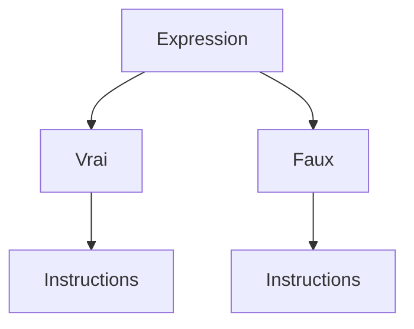

> ⚠️

> ℹ️
# Cours Python


## 1.1 Les variables

### Définition d'une variable
Python utilise des variables pour stocker des données. Une variable représente un espace mémoire nommé dans lequel une valeur est stockée, facilitant ainsi l'accès à cette information en mémoire.##

### Les types de variables en Python

Les variables peuvent contenir différents types de données. Voici les principaux types en Python :

- Entier (int) : Un nombre entier, comme 4.
- Flottant (float) : Un nombre décimal, comme 2.5 (note : en Python, on utilise un point pour les décimaux).
- Chaîne de caractères (str) : Un texte, comme 'hello' ou "a".
- Booléen (bool) : Une valeur logique, soit True (vrai) ou False (faux).

### Déclaration et nommage d'une variable
Pour déclarer une variable, on utilise le symbole "=" pour affecter une valeur à un nom de variable, qui est une étiquette pointant vers une zone mémoire.

> ⚠️ *A noter que les noms de variables doivent toujours commencer par une lettre ou un underscore "_" et ne pas être un mot réservé.*

Dans python, les mots réservés servent à définir la structure et la syntax du language Python (boucle, définition de fonction, etc.), ces mots clés ne peuvent être repris comme nom de variable.

La convention de nommage "snake_case" est utilisée en Python :

- sans majuscules,
- avec des underscores "_" entre les mots.

En revanche, dans certains langages, on utilise "CamelCase" avec des majuscules pour chaque mot, sans underscores.

Exemple de création et manipulation de variables en Python :
```
# Calcul du salaire mensuel à partir du salaire annuel

salaire_annuel = 36000    # Création d'une variable qui contient la valeur du salaire annuel
nb_mois = 12              # Création d'une variable qui contient le nombre de mois

# Pour calculer le salaire mensuel, je fais alors appel aux 2 variables précédemment créées
salaire_mensuel = salaire_annuel / nb_mois        
```

### Vérifier le type d'une variable existante
La fonction type() permet de vérifier le type d’une variable. Elle s’utilise ainsi :
```
# Déclaration de deux variables
salaire_annuel = 40000
prenom = 'Lionel'

# Affichage du type de chaque variable à l’aide de print() et type()
print(type(salaire_annuel))   # Affiche <class 'int'>
print(type(prenom))           # Affiche <class 'str'>
```

### Changer le type d'une variable en Python (cast)
En Python, il est parfois nécessaire de convertir une variable d'un type à un autre, par exemple pour faire des calculs entre différents types de données ou pour manipuler les données saisies par l'utilisateur. Cette opération s'appelle le casting.
Les fonctions de casting couramment utilisées en Python sont :

- int() pour convertir en entier,
- float() pour convertir en nombre décimal,
- str() pour convertir en chaîne de caractères.
Exemple de cast entre différents types :
```
# Conversion d'une chaîne en entier
age_str = "25"                     # Chaîne de caractères
age_int = int(age_str)             # Conversion de la chaîne en entier

# Conversion d'un entier en chaîne
salaire_annuel = 36000             # Entier
salaire_str = str(salaire_annuel)  # Conversion en chaîne de caractères

# Conversion d'un entier en flottant
age_flottant = float(age_int)      # Conversion d'un entier en flottant      
```

> ⚠️ *Si une conversion est impossible (par exemple, convertir une chaîne qui contient des lettres en entier), Python retournera une erreur.*


## Gérer les entrées/sorties
En Python, les fonctions print() et input() sont utilisées pour interagir avec l'utilisateur.

print() affiche un texte ou une valeur à l'écran.
input() permet de demander une saisie utilisateur. La valeur saisie est retournée sous forme de chaîne de caractères.
```
# Demander à l'utilisateur son nom.
nom = input("Quel est ton nom ? ")

# Afficher le nom de l'utilisateur.
print("Bonjour, " + nom + " !")
```
1. Chaîne de caractères (string) 📝  
C'est le cas le plus simple. La fonction `input()` renvoie directement une chaîne de caractères.

```
# Demander une chaîne de caractères
nom_utilisateur = input("Entrez votre nom : ")
print(f"Bonjour, {nom_utilisateur} !")
```

2. Entier (integer) 🔢  
Pour obtenir un nombre entier, il faut convertir la sortie de `input()` en utilisant la fonction `int()`.
```
# Demander un entier
try:
    age = int(input("Quel est votre âge ? "))
    print(f"Vous aurez {age + 1} ans l'année prochaine.")
except ValueError:
    print("Erreur : Veuillez entrer un nombre entier valide.")
```

3. Flottant (float) 💧  
Pour un nombre à virgule, le principe est le même, mais on utilise la fonction `float()`.
```
# Demander un flottant
try:
    prix = float(input("Entrez le prix de l'article (ex: 9.99) : "))
    prix_ttc = prix * 1.20
    print(f"Le prix toutes taxes comprises est de {prix_ttc:.2f} €.")
except ValueError:
    print("Erreur : Veuillez entrer un nombre valide.")
```

4. Booléen (boolean) ✅/❌  
Obtenir un booléen (`True` ou `False`) demande une petite logique supplémentaire, car l'utilisateur ne va pas taper "True" ou "False". L'idée est de vérifier si sa réponse correspond à une valeur affirmative.
```
# Demander une réponse et la convertir en booléen
reponse = input("Aimez-vous Python ? (oui/non) ")

# On convertit la réponse en minuscule pour être flexible
aime_python = reponse.lower() == "oui"

if aime_python:
    print("Super ! C'est un excellent langage.")
else:
    print("Dommage, peut-être une autre fois !")

# La variable aime_python contient maintenant True ou False
print(f"Valeur booléenne : {aime_python}")
```


## 1.2 Les opérateurs

### Qu'est ce qu'un opérateur en python ?

Un opérateur est un symbole (`+`, `>`, `=`,`<=`...) ou un mot réservé (`and`, `or`, `is`...) permettant de réaliser une opération.

Les opérateurs sont essentiels en programmation : ils permettent de réaliser des opérations mathématiques entre des variables (opérateurs arithmétiques), de comparer des valeurs (opérateurs de comparaison) ou de combiner des expressions vraies ou fausses (opérateurs logiques).

### Les opérateurs arithmétiques
Ces opérateurs permettent d'effectuer des opérations mathématiques comme par exemple l'addition ou encore la soustraction. Voici une liste des opérateurs arithmétiques que tu utiliseras fréquemment :

|Opérateur|Opération|Exemples|Résultat|
|:-:|:-:|:-:|:-:|
|+|Addition|5 + 2|7|
|+|Soustraction|5 - 2|3|
|*|Multiplication|5 * 2|10|
|/|Division|5 / 2|2.5|
|//|Division entière|5 // 2|2|
|%|Modulo (reste de la division)|5 % 2|1|
|**|Exponentiation|5 ** 2|25|

### Les opérateurs de comparaison

Ces opérateurs permettent de comparer deux valeurs, et le résultat est un booléen (`True` ou `False`). Voici une liste des opérateurs de comparaison avec des exemples :

|Opérateur|Opération|Exemples|Résultat|
|:-:|:-:|:-:|:-:|
|<|Inférieur|9 < 4.5|False|
|<=|Inférieur ou égal|9 <= 4.5|False|
|>|Supérieur|9 > 4.5|True|
|>=|Supérieur ou égal|9 >= 4.5|True|
|==|Egal|9 == 4.5|False|
|!=|Différent|9 != 4.5|True|
|is|Identique|9 is 4.5|False|
|is not|Non identique|9 is not 4.5|True|

### Les opérateurs logiques

Comme pour les opérateurs de comparaison, les opérateurs logiques renvoient un booléen. Tu rencontreras les opérateurs `and`, `or`, et `not`. Le tableau ci-dessous montre quelques exemples :

| Opérateur | Opération | Exemple | Résultat |
|---|---|---|---|
| **and** | Vérifie si deux expressions sont **toutes les deux vraies** | `x = 12`<br>`y = -32`<br>`(x > 0) and (y > 0)` | **False**<br>Une seule des deux expressions est vraie |
| **or** | Vérifie si parmi deux expressions **l'une ou l'autre est vraie** | `x = 12`<br>`y = -32`<br>`(x > 0) or (y > 0)` | **True**<br>Une des deux expressions est vraie |
| **not** | Inverse le résultat d'une expression | `not (9 <= 4.5)` | **True**<br>L'expression initiale renvoie False, le résultat final est donc True. |


## 1.3 Les structures conditionnelles

### L'indentation

En Python, l'indentation consiste à ajouter des espaces ou des tabulations en début de ligne pour structurer le code. Contrairement à de nombreux autres langages, où des symboles comme {} sont utilisés pour délimiter des blocs de code, Python utilise uniquement l'indentation pour indiquer quelles instructions appartiennent à un même bloc.

> ℹ️ La notion de bloc sera expliqué dans la suite de cette quête.

> ⚠️Règles d’indentation en Python
> - Espace ou tabulation : Il est recommandé d'utiliser 4 espaces pour chaque niveau d'indentation.
> - Cohérence : Mélanger espaces et tabulations dans le même fichier est déconseillé et peut entraîner des erreurs.

### Les structures conditionnelles
Dans la vie quotidienne, tu prends souvent des décisions en fonction de certaines informations.

Exemple :  
```
Demain s'il fait beau, j'irai à la plage.  
Sinon je resterai au chaud et je lirai un livre.
```  
En programmation, il est possible de représenter ce type de décision avec des structures conditionnelles qui permettent d’appliquer des instructions différentes selon les situations.


